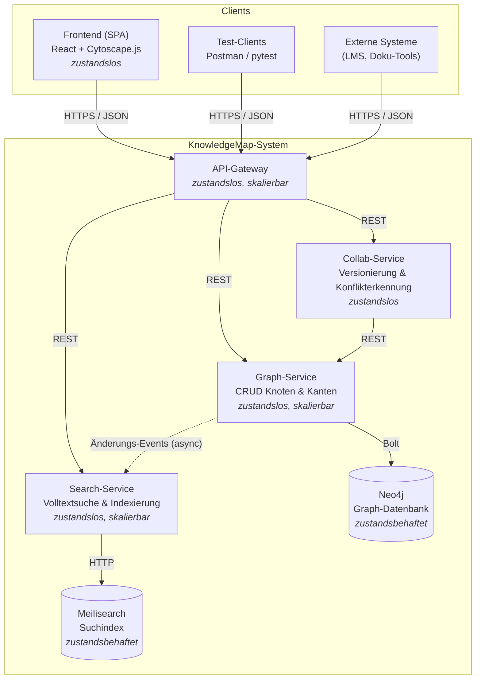

# KnowledgeMap – Architektur (MVP)

## Überblick

KnowledgeMap ist als komponentenbasiertes Microservice-System aufgebaut. Alle Services sind
**zustandslos** und damit horizontal skalierbar; Zustand liegt ausschließlich in den beiden
Datenhaltungs-Komponenten (Neo4j, Meilisearch). Die Kommunikation nach außen läuft
ausschließlich über das API-Gateway (REST/JSON, `application/json`).

## Architekturdiagramm

## Komponenten

| Komponente | Aufgabe | Zustand | Skalierung |
|---|---|---|---|
| API-Gateway | Einziger Eintrittspunkt, Routing, später AuthN/AuthZ | zustandslos | horizontal |
| Graph-Service | CRUD für Knoten/Kanten, Persistenz in Neo4j, publiziert Änderungs-Events | zustandslos | horizontal |
| Search-Service | Konsumiert Änderungs-Events, pflegt Suchindex, beantwortet Suchanfragen | zustandslos | horizontal |
| Collab-Service | Optimistisches Locking über Versionsnummern, Konflikterkennung bei konkurrierenden Änderungen | zustandslos | horizontal |
| Neo4j | Persistenz des Wissensgraphen | zustandsbehaftet | vertikal (MVP: 1 Instanz) |
| Meilisearch | Volltext-Suchindex | zustandsbehaftet | vertikal (MVP: 1 Instanz) |

## Externe Services

- **Neo4j** und **Meilisearch** werden als Standard-Versatzstücke per Docker eingebunden
  (keine Eigenentwicklung).
- Später denkbar: Identity Provider (z. B. Keycloak) für Zugriffsrechte, Object Storage für
  eingebettete Medien (Plugin-Architektur).

## Konsistenz-Entscheidung (Graph ↔ Suchindex)

Der Suchindex wird **asynchron** über Änderungs-Events aktualisiert (Eventual Consistency).
Begründung: Suchergebnisse dürfen wenige Sekunden hinterherhinken, dafür bleibt der
Schreibpfad des Graph-Service schnell und die Services sind entkoppelt. Im MVP werden die
Events als direkter HTTP-Call vom Graph- an den Search-Service realisiert; bei Bedarf kann
später eine Message Queue (z. B. RabbitMQ) dazwischengeschaltet werden, ohne die
Schnittstellen zu ändern.

## Konfliktbehandlung (kollaborative Bearbeitung)

Jeder Knoten trägt eine `version` (Integer). Schreibende Zugriffe müssen die erwartete
Version mitschicken (`If-Match`-Header). Stimmt sie nicht mit dem aktuellen Stand überein,
antwortet das System mit `409 Conflict` und liefert den aktuellen Stand zurück — der Client
kann dann mergen oder überschreiben (optimistisches Locking). CRDTs/Operational
Transformation sind bewusst **nicht** Teil des MVP.
